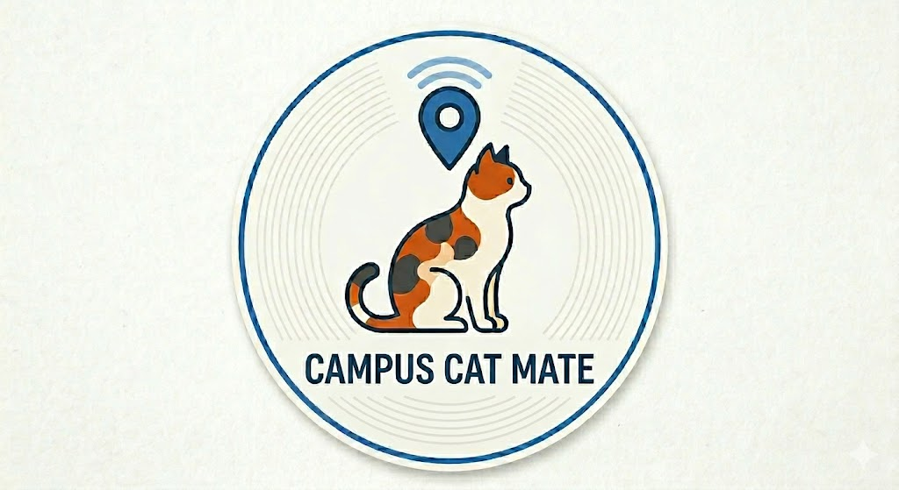
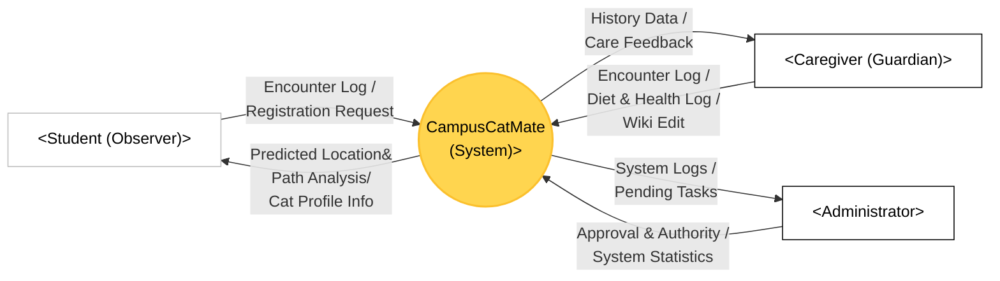

# [Conceptualization] 22411841_박다래

  

**Project Title:** 캠퍼스 냥이 메이트 (Campus Cat Mate)

**Student No:** 22411841

**Name:** 박다래

**E-mail:** ret7258@naver.com

**Github repository:** https://github.com/Pdar124/OSS_2026.git

### [ Revision history ]

| Revision date | Version | Description | Author |
| :--- | :--- | :--- | :--- |
| 03/27/2026 | **1.00** | First Draft | 박다래 |
| 03/27/2026 | **1.10** | Refined Actor Roles (Student, Caregiver, Admin) | 박다래 |
| 03/28/2026 | **1.11** | Refined diagrams and glossary| 박다래 |
| 03/28/2026 | **1.12** | Added Real-time Map features and refined documentation| 박다래 |
| 03/28/2026 | **1.13** | Refined project logo | 박다래 |
| 03/28/2026 | **1.20** |Integrated Predictive Location & Path Analysis Logic | 박다래 |

---

## = Contents =
1. Business purpose
2. System context diagram
3. Use case list
4. Concept of operation
5. Problem statement
6. Glossary
7. References

---

## 1. Business purpose

### 1.1 Project Background
캠퍼스 내 길고양이들은 학업에 지친 학생들에게 정서적 위안을 주는 소중한 존재입니다. 많은 학생이 길에서 마주친 고양이의 사진을 찍어 커뮤니티에 공유하거나 개인적으로 간식을 챙겨주며 교감합니다. 하지만 이러한 관심은 파편화되어 있어, 실시간 위치나 급여 현황에 대한 정보가 체계적으로 공유되지 못하고 금방 휘발된다는 한계가 있습니다.

### 1.2 Motivation
현재 캠퍼스 고양이 돌봄은 소수의 동아리원과 익명의 다수 학생에 의해 각자 이루어지고 있습니다. 이 과정에서 특정 고양이에게 사료 급여가 중복되어 비만이 되거나, 반대로 건강 이상 징후가 발견되어도 정보 공유가 늦어 방치되는 사각지대가 발생합니다. 저는 학생들이 평소처럼 사진을 찍어 올리는 가벼운 행위가 고양이의 건강을 지키는 유효한 데이터가 되길 바랐습니다. 학생들이 마주친 찰나의 기록들을 모아, 고양이와 인간이 더 건강하게 공존할 수 있는 환경을 만들고자 본 프로젝트를 기획하였습니다.

### 1.3 Goal
본 프로그램의 최우선 목표는 캠퍼스 전 구성원이 참여하는 체계적인 돌봄 네트워크 구축입니다.
첫째, 일반 학생들이 마주친 고양이를 실시간 제보하는 '조우 기록 (Encounter Check)' 기능과 이를 시각화한 '실시간 지도 (Real-time Map)'를 통해 고양이의 현재 위치와 예상 동선을 분석하여 즐거움을 제공합니다.
둘째, 주기적으로 고양이를 돌보는 인원들에게 전용 권한을 부여하여 식단 및 건강 상태를 전문적으로 관리하게 함으로써 중복 급여와 같은 비효율적 돌봄을 방지합니다.

### 1.4 Target Market
주 타겟은 고양이를 마주칠 때마다 반갑게 인사하며 사진을 남기고 싶어 하는 <b>평범한 재학생 및 교직원 전체(Student/Observer)</b>입니다. 또한, 주기적으로 사료를 챙기며 건강을 모니터링하는 <b>'캣맘/캣대디' 학생들과 돌봄 동아리(Caregiver/Guardian)</b>가 핵심 사용자층입니다. 나아가 캠퍼스 고양이를 아끼는 <b>지역 주민들</b>까지 사용자 범위를 확장하고자 합니다.

---

## 2. System context diagram

### 2.1 Context Model Diagram

### 2.2 Description for the Terms in the Diagram

#### [ Input Data (Actors → System) ]
| Term | Description |
| :--- | :--- |
| **Encounter Log** | 사용자가 고양이를 목격한 위치와 시간을 시스템에 전송하는 조우 기록 데이터입니다. |
| **Registration Request** | 미등록 고양이 발견 시 사진과 특징을 첨부하여 관리자에게 보내는 신규 등록 요청 데이터입니다. |
| **Diet & Health Log** | 돌보미가 기록하는 사료 급여 현황, 건강 특이사항 등 전문적인 케어 로그 데이터입니다. |
| **Wiki Edit / Authority** | 고양이의 특징 및 Territory(영역) 정보 수정 권한과 관리자의 승인/권한 제어 데이터입니다. |

#### [ Output Data (System → Actors) ]
| Term | Description |
| :--- | :--- |
| **Predicted Location & Path Analysis** | 시스템이 수집된 데이터를 분석하여 사용자(Student)에게 제공하는 고양이의 현재 예상 좌표 및 이동 동선 정보입니다. |
| **Cat Profile Info** | 위키에 저장된 고양이의 이름, 나이, 성격, 주의사항 등 개체별 상세 프로필 정보입니다. |
| **History & Feedback** | 과거 급여 이력 및 건강 변화 추이를 분석하여 돌보미에게 제공하는 사후 관리 피드백입니다. |
| **Logs & Pending Tasks** | 관리자가 운영 무결성을 유지하기 위해 확인하는 시스템 활동 로그 및 승인 대기 업무 목록입니다. |

#### [ 사용자 (Actors) & 시스템 ]
| Term | Description |
| :--- | :--- |
| **CampusCatMate** | 캠퍼스 고양이의 실시간 위치 분석, 급여 기록, 집단지성 위키 데이터, 지능형 식별 알고리즘를 통합 관리하는 본 프로젝트의 핵심 시스템입니다. |
| **Student (Observer)** | 일반 학생 사용자. 시스템에 조우(Encounter)한 고양이 위치 제보 및 신규 등록 요청 데이터를 제공하고, 고양이의 실시간 위치와 정보를 제공받는 사용자층입니다.|
| **Caregiver (Guardian)** | 인증된 돌보미 사용자. , 고양이의 식단 기록(Diet Check), 건강 상태 로그 작성을 수행하며 위키 문서의 전문적인 편집 권한과 및 고양이 영역(Territory) 설정 편집 권한을 가집니다. |
| **Administrator** | 시스템 관리자. 새로운 고양이 프로필 등록을 승인하고, 돌보미 권한 부여 및 시스템 전반의 활동 통계를 관리하여 운영 무결성을 유지합니다. |

---

## 3. Use case list
| No | Use Case | Actor | Description |
| :--- | :--- | :--- | :--- |
| 1 | **Login** | All | 등록된 계정을 통해 시스템 권한을 획득하고 개인 세션을 유지한다. |
| 2 | **Encounter Check** | Student, Caregiver | 고양이를 발견한 위치/시간을 제보하며, 영역 기반 식별 알고리즘을 통해 후보 개체를 추천받아 기록을 확정한다. |
| 3 | **Request Cat Reg.** | **Student, Caregiver** | 캠퍼스 내 미등록 고양이 발견 시 사진, 특징, 발견 위치를 첨부하여 관리자 승인 큐(Approval Queue)에 등록을 요청한다.|
| 4 | **Approve Cat Reg.** | **Admin** | 이용자들의 신규 고양이 등록 요청 건을 검토하여 **공식 데이터로 승인 및 등록**을 완료한다. |
| 5 | **Diet Check** | Caregiver | 급여한 사료의 종류, 양 및 건강 특이사항을 기록하여 중복 급여 방지 및 건강 모니터링 데이터를 생성한다. |
| 6 | **Wiki Edit** | Caregiver, Admin | 고양이의 특징, 건강 상태, 이름 유래 및 **주요 활동 영역(Territory)** 정보를 최신 상태로 업데이트한다. |
| 7 | **History View** | All | 위키 내용의 과거 수정 이력을 조회하여 데이터의 신뢰성을 확인하고 악의적인 수정을 모니터링한다. |
| 8 | **Real-time Map View** | All | 최근 제보 데이터와 최근 제보 가중치(Recency Weight)가 적용된 고양이별 실시간 예상 위치를 지도상에서 확인한다. |
| 9 | **Path Analysis View** | Student, Caregiver | 시간대별 루틴에 따라 고양이가 이동할 가능성이 높은 예상 동선(Predicted Path) 분석 결과를 확인한다.
---

## 4. Concept of operation

### 1. Register member & Log-in (사용자 등록 및 인증)
| Item | Description |
| :--- | :--- |
| **Purpose** | 사용자를 식별하고 권한에 따른 차등 서비스를 제공함. |
| **Approach** | 아직 등록하지 않은 사용자는 회원가입을 통해 계정을 생성한다. 이름, 학번(또는 연락처) 등의 필수 정보를 기입하며, ID는 학번/연락처로 고정되어 중복을 방지한다. 가입 정보는 DB에 저장되며, 로그인 후 권한(Student/Caregiver)에 따라 메뉴가 활성화된다. |
| **Dynamics** | 위치 제보, 신규 등록 요청 등 시스템의 주요 기능을 사용하기 위해 본인 인증이 필요한 경우 발생. |
| **Goals** | 사용자 인증을 통해 데이터 기록의 책임성을 확보하고 효율적인 권한 관리를 수행함. |

### 2. Intelligent Identification & Encounter check (지능형 식별 및 위치 제보)
| Item | Description |
| :--- | :--- |
| **Purpose** | 실시간 목격 위치를 수집하고 제보된 고양이가 누구인지 정확히 판별함. |
| **Approach** | 사용자가 고양이를 발견해 '제보하기' 버튼을 누르면, 시스템은 사용자의 현재 GPS 좌표를 즉시 인식한다. 해당 좌표가 특정 고양이의 '주요 활동 영역'에 포함될 경우, 앱 화면에 <b>"이 근처에 사는 '치즈'인가요?"</b>라는 추천 팝업을 띄운다. 사용자는 복잡한 고양이 목록을 검색할 필요 없이, 시스템이 제시한 후보 중 하나를 선택하는 것만으로 제보를 완료할 수 있다. |
| **Dynamics** | 사용자가 고양이를 마주쳤으나 정확한 개체를 식별하지 못해 데이터 오염이 우려되는 상황에서 발생. |
| **Goals** | 영역 동물의 특성을 활용해 오제보를 방지하고, 실시간 위치 정보의 신뢰도를 극대화함. |

### 3. Caregiver Log management (돌봄 및 급여 현황 관리)
| Item | Description |
| :--- | :--- |
| **Purpose** | 중복 급여를 방지하고 고양이의 건강 상태를 체계적으로 모니터링함. |
| **Approach** | 인증된 돌보미(Caregiver)는 고양이별 급여 및 건강 로그를 조회할 수 있다. 날짜, 사료 종류, 특이사항 등 모든 과거 데이터를 확인할 수 있으며, 기록은 작성자 본인만 수정 가능하고 전체 관리는 관리자만 수행하여 데이터 무결성을 유지한다. |
| **Dynamics** | 돌보미가 사료를 급여한 후 기록을 공유하여 중복 급여를 예방하고자 하는 경우 발생. |
| **Goals** | 급여 현황을 가시화하여 효율적인 돌봄을 지원하고 고양이의 건강 문제를 사전 예방함. |

### 4. New Cat Registration Workflow (신규 고양이 등록 프로세스)
| Item | Description |
| :--- | :--- |
| **Purpose** | 캠퍼스 내 새로운 고양이를 시스템 도감에 공식적으로 추가함. |
| **Approach** | **학생과 돌보미 구분 없이 누구나** 새 고양이의 사진과 특징을 작성하여 등록 요청을 보낼 수 있다. 관리자(Admin)는 승인 큐(Approval Queue)에서 이를 검토하며, 승인이 완료되기 전까지는 '임시 데이터'로 분류되어 일반에게 노출되지 않는다. 최종 등록 시 공식 위키 페이지가 생성된다. |
| **Goals** | 전 구성원의 참여로 데이터를 수집하되, 관리자의 승인을 거쳐 데이터의 품질을 유지함. |

### 5. Intelligent Path & Location Prediction (지능형 위치 및 동선 예측)
| Item | Description |
| :--- | :--- |
| **Purpose** | 사용자가 고양이를 찾고 싶을 때, 현재 어디에 있을 가능성이 높은지 정보를 제공함. |
| **Approach** | 제보가 없는 공백 시간에도 시스템은 고양이별 '영역(Territory)' 중심점과 **루틴 데이터**를 결합하여 현재 확률이 높은 지점을 **예상 위치**로 지도에 표시한다. 또한 시계열 분석을 통해 다음 예상 지점까지의 **예상 동선**을 화살표로 제공한다. |
| **Goals** | 사용자가 고양이를 마주칠 확률을 높여 즐거움을 제공하고 참여 동기를 유발함. |
---

## 5. Problem statement

### 5.1 Overview: Understanding Feline Ecology
본 프로젝트의 핵심 기술인 ***영역 기반 식별*** 과 ***루틴 보정 알고리즘*** 은 고양이의 독특한 생태적 특성에 기반합니다. 기술적 난제와 해결책을 이해하기 위해서는 캠퍼스 고양이의 두 가지 핵심 생태적 특성을 이해해야 합니다.

1. 영역성(Territoriality)과 식별 오류: 길고양이는 일정한 공간을 자신의 영토로 점유하며, 먹이 활동과 휴식을 해당 구역 내에서 해결합니다. 이는 고양이가 캠퍼스 전역을 무작위로 배회하는 것이 아니라, 특정 GPS 좌표 범위 내에 머무를 확률이 매우 높음을 의미합니다. 하지만 캠퍼스 내에는 외형이 유사한 고양이가 많아, 사용자가 단순히 목격 위치만으로 개체를 판단할 경우 데이터 오염이 발생합니다. 본 시스템은 고유한 Territory-based ID 로직을 통해 GPS 좌표와 해당 구역의 주인 데이터를 대조하여 오제보를 원천 차단합니다.

2. 루틴(Routine)의 가변성과 예측 모델: 고양이는 시간대별로 매우 규칙적인 루틴을 가지지만, 기상 악화나 외부 소음 등 환경 변화에 따라 일시적으로 루틴을 이탈하기도 합니다[Ref-6]. 단순 통계만으로는 이러한 변수를 해결할 수 없기에, 본 시스템은 '최근 제보 가중치(Recency Weight)' 알고리즘을 적용하여 실시간 제보 데이터를 기반으로 예측 맵을 즉각 보정합니다.

3. 집단지성의 충돌 관리: 수많은 학생이 동시에 위키를 편집하고 제보하는 과정에서 데이터 충돌은 필연적입니다. 이를 해결하기 위해 Optimistic Locking(낙관적 락) 기법을 도입하여, 고양이의 생태 데이터가 항상 최신 상태의 무결성을 유지하도록 설계하였습니다.

---

### 5.2 The Solution

### 5.2-1 Technical Difficulties (기술적 난제 및 해결 방안)
| Category | Description |
| :--- | :--- |
| **Territory-based ID** | **[Problem]** 사용자가 개체를 혼동하여 잘못 제보할 경우 루틴 데이터가 오염됨.  **[Solution]** **'영역 기반 식별(Territory Identification)'** 로직을 구현한다. GPS 좌표와 시간대별 영역 데이터를 대조하여 가장 확률이 높은 개체를 사용자에게 자동 추천함으로써 오제보를 방지한다. |
| **Predictive Mapping** | **[Problem]** 제보가 없는 공백 시간대에 고양이 위치 파악 불가.  **[Solution]** **영역(Territory) 데이터와 루틴**을 결합하여 현재 시간대에 가장 확률이 높은 지점을 **예상 위치**로 자동 생성하여 지도에 표시한다. |
| **Path Analysis** | **[Problem]** 단순 점 제보만으로는 이동 흐름 파악이 어려워 마주치기 힘듦.  **[Solution]** 직전 제보와 다음 루틴 지점을 시계열로 연결하는 '예상 동선 분석 알고리즘'을 통해 이동 방향을 시각화한다. |
| **Routine Algorithm** | **[Problem]** 환경 변화나 외부 요인으로 고양이가 기존 루틴을 이탈할 시 예측이 실패함.  **[Solution]** **'최근 제보 가중치(Recency Weight)'** 알고리즘을 적용한다. 1시간 이내의 실시간 제보 데이터에 가중치를 부여하여 예측 맵을 즉각 보정하고, 기상청 API를 연동하여 상황별 루틴 모델을 구축한다. |
| **Concurrency Control** | 위키 수정 시 발생하는 충돌 방지를 위해 **'낙관적 락(Optimistic Locking)'** 또는 편집 중인 사용자에게 임시 잠금 권한을 부여하는 세션 관리 로직을 구현한다. |

### 5.2-2 Traceability & Integrity (추적성 및 무결성 - NFR)
| Category | Description |
| :--- | :--- |
| **Data Integrity** | 모든 급여 및 건강 기록은 학번 ID와 결합되어 저장된다. 서버 측에서 모든 변경 이력을 **Append-only Log** 형태로 보관하며, 악의적인 조작에 대비해 변경 전후 스냅샷 보존 및 롤백 기능을 지원한다. |
| **Data Validation** | 모든 이용자의 신규 개체 등록이 가능함에 따라 발생하는 허위/중복 제보를 막기 위해 관리자 승인 시스템을 운영하며, 중복 가능성이 있는 요청은 시스템이 자동 필터링하여 관리자에게 알린다. |

### 5.2-3 Reliability & Usability (신뢰성 및 사용성 - NFR)
| Category | Description |
| :--- | :--- |
| **Mobile UX** | 야외 제보의 짧은 순간을 고려하여 '원터치 위치 전송' 및 '사진 업로드' 위주의 직관적인 UI를 설계한다. |
| **Offline Buffering** | 네트워크 음영 지역에서의 데이터 유실을 방지하기 위해 **클라이언트 측 로컬 캐싱** 기능을 구현하여 네트워크 복구 시 자동으로 서버에 전송되도록 보장한다. |

---

## 6. Glossary

| Term | Definition |
| :--- | :--- |
| **Real-time Map (실시간 지도)**| 최근 수집된 조우 기록을 기반으로 고양이들의 현재 위치와 예상 동선을 지도 인터페이스상에 시각화하여 보여주는 기능. |
| **Path Analysis**| 루틴 데이터를 기반으로 고양이의 이동 흐름을 화살표나 경로로 예측하여 보여주는 기능. |
| **Encounter Check (조우 기록)** | 사용자가 캠퍼스 내에서 고양이를 발견한 위치와 시간을 시스템에 제보하는 행위. 제보 시 영역 기반 식별 알고리즘을 통해 해당 개체를 추천한다. |
| **Student (Observer)** | 위치 제보 및 신규 고양이 등록 요청이 가능한 일반 사용자. |
| **Caregiver (Guardian)** | 등록 요청 및 전문 돌봄 기록(식단, 건강) 권한을 가진 인증된 사용자. |
| **Territory (영역)** | 특정 고양이가 주로 활동하며 방어하는 캠퍼스 내 지리적 범위. |
| **Territory-based ID** | 현재 위치와 영역 데이터를 대조하여 개체를 자동 판별 및 추천하는 알고리즘. |
| **Approval Queue(승인 큐)** | 일반 사용자가 요청한 신규 고양이 등록 건이 관리자의 최종 승인을 받기 전까지 임시로 머무르는 대기열 상태. |
| **Append-only Log** | 데이터 수정 시 기존 데이터를 지우지 않고 새로운 기록을 덧붙여 모든 변경 이력을 추적할 수 있게 하는 기록 방식. |
| **Offline Buffering** | 네트워크 단절 시 데이터를 임시 저장했다가 연결 시 자동 전송하는 기술. |
| **Optimistic Locking (낙관적 락)** | 여러 사용자가 동시에 데이터를 수정할 때 충돌을 방지하기 위해 버전 정보를 확인하는 관리 기법. |
| **Recency Weight (최근 제보 가중치)** | 예측 모델에서 과거의 통계 데이터보다 최근(예: 1시간 이내)에 발생한 실제 제보 데이터에 더 높은 우선순위를 두어 실시간 위치를 보정하는 계산 방식. |
| **Diet Check (급여 기록)** | Caregiver가 고양이에게 제공한 사료의 종류, 양, 시간을 기록하는 행위. 중복 급여를 방지하는 핵심 데이터로 활용됨.에 데이터를 수정할 때 충돌을 방지하기 위해 버전 정보를 확인하는 관리 기법. |
| **Routine Data (루틴 데이터)** | 특정 고양이가 시간대별, 요일별로 반복적으로 머무르는 장소와 활동 패턴을 수치화한 기초 데이터. |

---

## 7. References

| No | Source | Description / Context |
| :--- | :--- | :--- |
| **Ref-1** | 에브리타임 (Everytime) | 캠퍼스 커뮤니티 내 고양이 정보 공유 니즈 및 사용자 패턴 분석. |
| **Ref-2** | 동물권행동 카라 (KARA) | 대학 길고양이 돌봄 가이드라인 : 체계적 모니터링 및 영역 관리 근거. |
| **Ref-3** | Google Maps API | 캠퍼스 내 정확한 위치 태깅 및 영역 시각화를 위한 기술 문서. |
| **Ref-4** | OpenWeatherMap API | 기상 상황에 따른 활동 패턴 및 영역 이동 보정용 데이터 수집. |
| **Ref-5** | [Home Range of Free-Roaming Cats](https://wildlife.onlinelibrary.wiley.com/journal/19372817)| 고양이의 지리적 영역 점유 및 행동 반경 연구. |
| **Ref-6** | [Applied Animal Behaviour Science](https://www.sciencedirect.com/journal/applied-animal-behaviour-science) |환경 변화에 따른 고양이의 활동 루틴(Circadian Rhythms) 연구. |